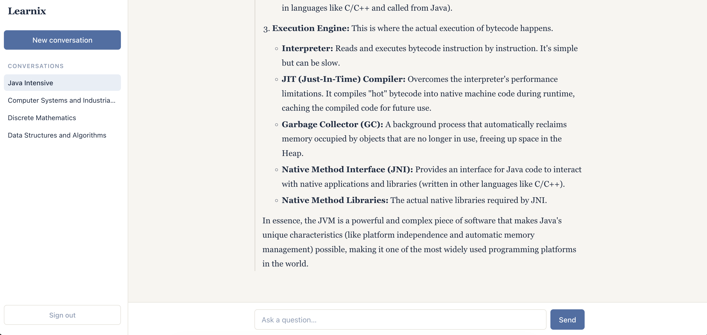

# Learnix

A learning platform where students can ask an AI assistant about what they're studying, with conversations saved to their account so they can pick up where they left off.

Built this as a capstone project to go deeper than a typical CRUD app — the goal was a full-stack application with real authentication, real persistence, and a working third-party AI integration, deployed and reachable rather than just running on my machine.

**Live demo:** [https://learnix-n16i.onrender.com](https://learnix-n16i.onrender.com) 

> Register an account to try it — conversations are private to each user.

## Features

- **JWT authentication** — register, sign in, sign out, with tokens signed and verified server-side
- **Protected routes** — unauthenticated users are redirected to login with a clear message
- **AI assistant** — powered by the Gemini API, with markdown-formatted responses
- **Persistent chat history** — every conversation is saved and resumable across sessions and devices
- **Per-user data isolation** — users can only access their own conversations; the API verifies ownership on every request
- **Graceful degradation** — rate limits and API failures return readable messages instead of errors

## Tech stack

**Backend**
- Java 21, Spring Boot 4
- Spring Security + JWT (jjwt)
- Spring Data JPA / Hibernate
- PostgreSQL (Docker locally, managed instance in production)
- JUnit 5, Mockito

**Frontend**
- React 19, React Router
- Axios with an auth interceptor
- Jest, React Testing Library

**Infrastructure**
- Docker (multi-stage build)
- GitHub Actions (CI on every pull request)
- Render (backend, database, and static frontend)

## Architecture

The backend follows a layered structure — controllers stay thin and delegate to services, which own the business logic and talk to repositories:

```
Controller  →  Service  →  Repository  →  PostgreSQL
                  ↓
              AiService  →  Gemini API
```

A few decisions worth noting:

**JWT over sessions.** The API is stateless (`SessionCreationPolicy.STATELESS`), so no server-side session storage. A custom `JwtAuthenticationFilter` runs before the controllers, reads the `Authorization` header, verifies the signature, and marks the request as authenticated.

**Ownership checks at the service layer.** A valid token proves *who* you are, not *what* you're allowed to see. Every request for a chat session compares the session's owner against the authenticated user before returning anything — preventing IDOR (Insecure Direct Object Reference), where a user could otherwise read someone else's conversation by guessing an ID.

**DTOs at every boundary.** Entities are never serialized directly. Besides avoiding infinite JSON nesting from bidirectional relationships, this keeps sensitive fields (like password hashes) out of API responses entirely.

**Schema.** Users own many chat sessions; sessions own many messages, with cascade and orphan removal so deleting a user cleans up cleanly. Courses and users are many-to-many via a join table.

## Running locally

**Prerequisites:** JDK 21+, Maven, Node.js, Docker, and a [Gemini API key](https://ai.google.dev/).

**1. Start PostgreSQL:**

```bash
docker run --name learnix-postgres \
  -e POSTGRES_USER=lms_user \
  -e POSTGRES_PASSWORD=your_password \
  -e POSTGRES_DB=lms_db \
  -p 5432:5432 \
  -d postgres:16
```

**2. Configure the backend.** Copy the example config and fill in your values:

```bash
cp src/main/resources/application-dev.properties.example \
   src/main/resources/application-dev.properties
```

You'll need a database password, a Gemini API key, and a JWT secret of at least 32 characters (HS256 requires a 256-bit key):

```bash
openssl rand -base64 48
```

**3. Run the backend:**

```bash
mvn spring-boot:run -Dspring-boot.run.profiles=dev
```

**4. Run the frontend:**

```bash
cd frontend
npm install
npm start
```

Open `http://localhost:3000`.

## Tests

```bash
mvn clean test        # backend
cd frontend && npm test   # frontend
```

Backend tests cover service logic, controllers, and the Gemini integration (with the HTTP client mocked, so tests run offline). Frontend tests cover rendering, user interaction, and API calls including auth headers.
